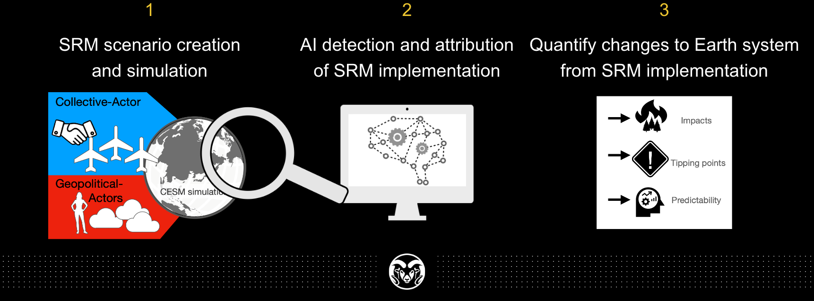

# AI Methods for Solar Radiation Management Research
***
Artificial intelligence to detect, attribute, and quantify solar radiation management (SRM) effects and risks under a range of geopolitical scenarios.

## Team
This work is a collaborative effort across a team of contributors at Colorado State University and partners:
* Dr. James Hurrell [PI]
* [Dr. Elizabeth A. Barnes](https://barnes.atmos.colostate.edu) [PI]
* Dr. Curtis Bell [Naval War College]
* [Daniel Hueholt](https://www.hueholt.earth/)
* Dr. Patrick Keys
* [Dr. Zack Labe](https://zacklabe.com/)
* [Dr. Antonios Mamalakis](https://amamalak.wixsite.com/antonios)
* [Dr. Kirsten Mayer](https://sites.google.com/rams.colostate.edu/kirsten-j-mayer/home)
* [Dr. Ariel Morrison](https://www.ariel-morrison.com)
* Dr. ChenRui Diao

## Project Summary
Solar radiation management (SRM) refers to the possibility of moderating anthropogenic warming and lessening its impacts, including natural systems approaching irreversible tipping points, by making the atmosphere more reflective of incoming solar radiation. Conclusions about the effectiveness, risks and detectability of SRM are highly uncertain, however, and are dependent upon the specifics of the modeling scenario. To-date, assessments of SRM typically consider just one scenario with one particular choice of temperature target, and one particular injection strategy. Moreover, many assessments are done on very idealized SRM scenarios performed with relatively simple representations of the climate.

> GOAL: Develop explainable AI techniques to rapidly detect SRM efforts and quantify their impacts by exploring a range of futures that span scenarios from the world working together to achieve a desired climate goal to geopolitically-motivated unilateral pursuit of SRM.

Our approach is three-fold:
1. Design, simulate and analyze plausible geopolitically-motivated SRM deployment scenarios
2. Develop and apply novel Artificial Intelligence (AI) algorithms to detect, attribute, and quantify solar radiation management (SRM) effects on climate
3. Use AI to quantify the risks and uncertainties of Earth system impacts under different SRM scenarios

## Publications and Preprints

## Presentations
+ Labe, Z.M., E.A. Barnes, and J. Hurrell. Detecting the regional emergence of climate signals with machine learning in a set of stratospheric aerosol injection simulations, *2022 American Geophysical Union Annual Meeting*, Chicago, IL (Dec 2022) [[Abstract]](https://agu.confex.com/agu/fm22/meetingapp.cgi/Paper/1110391)

## Extra Information

#### Funding source
Funded by DARPA‐PA‐21‐04‐02 with PIs Prof. James Hurrell and [Prof. Elizabeth A. Barnes](https://barnes.atmos.colostate.edu) at Colorado State University.

#### License
This project is licensed under an MIT license.

MIT © [Elizabeth A. Barnes](https://github.com/eabarnes1010)
