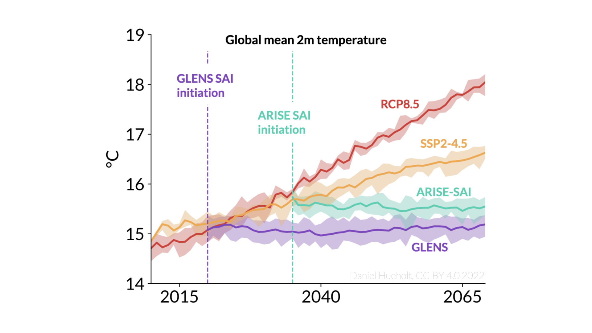

# Summarizing regional and global climate responses to GLENS and ARISE
***
We analyze the regional and global climate responses in GLENS and ARISE for a
variety of familiar variables. We identify research questions that allow us to
use GLENS and ARISE together.

## Project Summary
The regional and global climate responses to SAI are not well understood. In
particular, it is unknown whether SAI could improve or worsen existing
inequalities in climate risk. **We develop code to visualize the response of
variables in the GLENS and ARISE experiments across global and regional scales.**
While this code is designed for these particular experiments it can be easily
extended, in principle, to any dataset that uses the Community Earth System
Model architecture.

## Key Research Questions
1. "What happens before and after initiation?"
2. “What is the impact of the intervention in each scenario?”

In our in-prep publication, **we address these questions for a subset of
high-impact, well-constrained variables.** This work is intended to provide a
“one-stop shop” of useful figures, and a point of entry for researchers and
stakeholders new to SAI.

The variables we examine include data with minimal processing (e.g. 2m annual
mean temperature, annual mean precipitation) and some requiring significant
computational time to calculate (e.g. ETCCDI extremes, marine heatwaves). We
will provide access to the final processed datasets that allow the replication
of published figures and results. For raw data, we will likely provide pointers
to the location of data on the National Center for Atmospheric Science GLADE
file system.

***

## TODO
- [x] Add Readme - 6/13/2022
- [ ] Upload code
- [ ] Describe dependencies
- [ ] Upload processed data
- [ ] Point to raw data

## Metadata
Funded by DARPA‐PA‐21‐04‐02 with PIs Prof. James Hurrell and
[Prof. Elizabeth A. Barnes](https://barnes.atmos.colostate.edu) at Colorado
State University.

Except where otherwise specified, this code written and maintained by
[Daniel Hueholt](https://www.hueholt.earth/) as a Graduate Research Assistant at
Colorado State University, co-advised by Prof. James Hurrell and Prof. Elizabeth
Barnes.

* Code in this project is licensed under the Open Software License 3.0, included with this repository as `LICENSE.txt`
* Figures and text associated with this project are licensed under [Creative Commons Attribution Share Alike 4.0 International](https://creativecommons.org/licenses/by-sa/4.0/)
